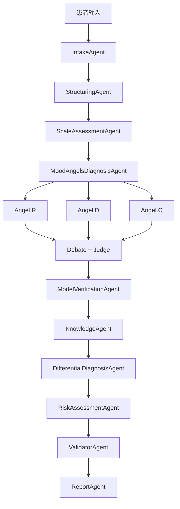

# 架构图

```mermaid
flowchart TD
  A[患者输入] --> B[IntakeAgent]
  B --> C[StructuringAgent]
  C --> D[ScaleAssessmentAgent]
  D --> E[MoodAngelsDiagnosisAgent]
  E --> E1[Angel.R]
  E --> E2[Angel.D]
  E --> E3[Angel.C]
  E1 --> EJ[Debate + Judge]
  E2 --> EJ
  E3 --> EJ
  EJ --> F[ModelVerificationAgent]
  F --> G[KnowledgeAgent]
  G --> H[DifferentialDiagnosisAgent]
  H --> I[RiskAssessmentAgent]
  I --> J[ValidatorAgent]
  J --> K[ReportAgent]
```
